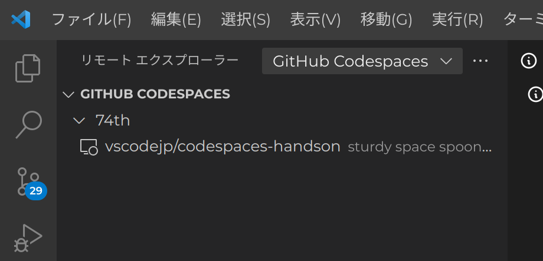

# GitHub Codespaces 徹底活用ハンズオン-VS Code Conf JP 2022-23

全体アーキテクチャー図

## イベントページ

https://vscode.connpass.com/event/269712/

## ハンズオンテキスト

[docs/README.md](docs/README.md)

## 事前準備

- GitHub へのユーザ登録 → https://github.com/signup
- VS Code のインストール → https://code.visualstudio.com/
  - [インストールの仕方 https://github.com/vscodejp/handson-hello-vscode/blob/master/topic0.1/README.md](https://github.com/vscodejp/handson-hello-vscode/blob/master/topic0.1/README.md)
- VS Code の拡張機能 GitHub Codespaces のインストール
- VS Code から GitHub Codespaces への認証

### VS Code の拡張機能 GitHub Codespaces のインストール

拡張機能タブから、Codespaces と入力して検索し、GitHub Codespaces の項目をインストールしてください。

### VS Code から GitHub Codespaces への認証

VS Code にて、アクティビティーバーからリモートエクスプローラー（図の 1）を選びます。

上部のプルダウン（図の 2）から「Codespaces」を選びます。

「Sign in to Codespaces」（図の 3）をクリックして、認証を進めます。

「Sign in to Codespaces」の代わりに GitHub アカウント ID が表示されていたら完了です。

## ハンズオン内容サマリー

[docs/summary.md](docs/summary.md)

## GitHub Codespaces インスタンスの削除の仕方

### 方法 1

VS Code 中のリモートエクスプローラーから、削除したい Codespaces を右クリックして、Delete を選択。

### 方法 2

GitHub のリポジトリページから

### 方法 3

GitHub のヘッダーから、[Codespaces インスタンスの一覧ページ](https://github.com/codespaces)に飛べます。

